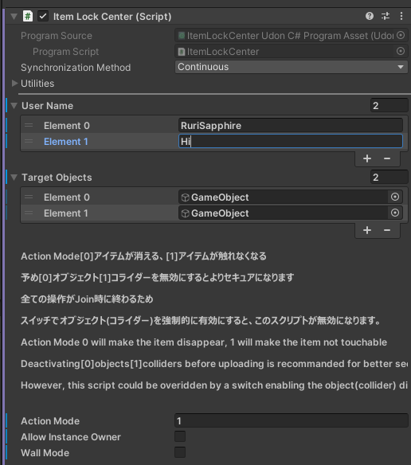

# Simple Item Lock

Simple Item Lock はVRChatワールドで、アイテムを特定の人にしか触れないようにしたり、見えないようにしたりするギミックです。

コライダーに動作するため、テレポーターなどにも動作します。

Simple Item Lock is a simple way to make your item being used or seen by using a white list.

It works with colliders, so items like teleporters will also work.

### 特徴 / Features

コライダーモード、無効モード選択可能 / Collider mode and disable mode available.

導入ツール付き / Ships with import tool.

選べるインスタンスオーナー許可 / Allow instance owner option available.

2つ以上共存可能 / Support for multiple locks to be used at same time.

ジョイン時に実行 / Runs at join.

パフォーマンス影響小 / Low performance cost.

### 注意事項 / Limitations

ジョイン時に実行されるため、ターゲットオブジェクトをスイッチでオンにするとスクリプトが無効になります。

そのため、ワールドでユーザーを追加したり、削除したりすることができません。

導入ツールでは許可の時にオブジェクト・コライダーを有効にするため、特定の人しか抜けない壁を作ったりすることができません。（次のBetaで導入予定、他の導入方法では利用できます。）

This script will be run at join, thus enabling the targets object with switches will make this script useless.

Therefore, adding or deleting whitelisted users in VRChat is not supported.

Using the import tool will enable the object or collider only when the person is whitelisted, thus creating a wall that only whitelisted people can go through is not currently supported. (Available at next beta, other methods work in this version)

### 導入

3種類の導入方法があります。 / There are three ways to import this gimmick.

準備 / Preparation

1. Release でunitypackageをダウンロードします。 / Download at Release page.

2. Unityの**ワールド**プロジェクトに導入します。 / Import to a **World** project.

#### 導入ツールを利用する / Use the import tool

ツールバーのStudio Saphirタブで Item Lock Settingsを開きます。

Open Studio Saphir/Item Lock Settings at tool bar.

ユーザー名を入力します。入力できない場合では、右下の+マークを押してください。User Nameにあるすべてのユーザーがこのオブジェクトを操作できます。

Using the + mark at bottom right corner and input usernames for whitelisted users.

アイテムリストを作ります。Target Object は対象アイテムです。Action Mode 0では許可されないユーザーがオブジェクトを見えない（無効モード）、1では動かせないです。Allow Instance Ownerを有効にすれば、インスタンスを作った人が許可されます。

Create the item list. At action mode 0 only whitelisted users can see the object, and at 1 only they can move the object.

**一番上のGenerate Dataを押す。この作業は毎回編集する時に必要になります。**

**Click the Generate Data Button at top. This should be done for every time the list is edited.**

ItemLockCenter(Managed)がシーンの中で配置されます。（動かさないようにしてください）Advanced Prefabと同じ方法で編集できます。

ItemLockCenter(Managed) will be placed at the scene. (Do not move this object) You can edit this using the same ways as advanced prefabs.

> Wall Mode を無効にするため、Wall Mode をご利用の方は下のPrefabをご利用ください。

> This scripts removes wall mode settings for now. Please use the prefab method to edit wall mode enabled objects.

#### Prefabを利用する / Use the prefab

2種類のPrefabがあります。 Advancedでは、アイテム一つ一つでインスタンスオーナーの許可を編集したり、モードを選択したりすることができますが、毎回Generate Dataを押す必要があります。Advanced がない方では、すべてのオブジェクトが同じような設定になります。設定の手順はほぼ同じです。

There are two types of prefabs. Advanced prefab allow editing modes and the options for allowing instance owner for each object, with a drawback of requiring clicking the Generate Data button every time the object is edited. The prefab without Advanced will let all target objects have the same settings.

ユーザー名を入力する。入力できない場合では、右下の+マークを押してください。User Nameにあるすべてのユーザーがこのオブジェクトを操作できます。

Using the + mark at bottom right corner and input usernames for whitelisted users.

アイテムリストを作ります。Target Object は対象アイテムです。Action Mode 0では許可されないユーザーがオブジェクトを見えない（無効モード）、1では動かせないです。Allow Instance Ownerを有効にすれば、インスタンスを作った人が許可されます。Wall Modeを有効にすれば、特定の人しか通れない壁が作れます。

Create the item list. At action mode 0 only whitelisted users can see the object, and at 1 only they can move the object. Enabling Wall Mode can allow creation of whitelisted walls that only allow whitelisted people to go through.

**Advanced PrefabではGenerate Dataを押す。この作業は毎回編集する時に必要になります。**

**Click the Generate Data Button for Advanced Prefab. This should be done for every time the list is edited.**

#### 一つオブジェクトのみ利用する / Use single object script

対象オブジェクトにItemLockUsernameというスクリプトをD&Dします。

Drag and drop ItemLockUsername script to target object.

ユーザー名を入力する。入力できない場合では、右下の+マークを押してください。User Nameにあるすべてのユーザーがこのオブジェクトを操作できます。

Using the + mark at bottom right corner and input usernames for whitelisted users.

Action Mode 0では許可されないユーザーがオブジェクトを見えない（無効モード）、1では動かせないです。Allow Instance Ownerを有効にすれば、インスタンスを作った人が許可されます。Wall Modeを有効にすれば、特定の人しか通れない壁が作れます。

At action mode 0 only whitelisted users can see the object, and at 1 only they can move the object.Enabling Wall Mode can allow creation of whitelisted walls that only allow whitelisted people to go through.