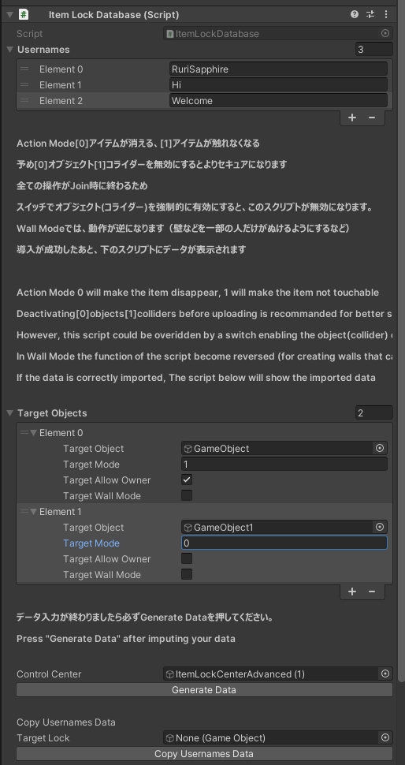

# Simple Item Lock

Simple Item Lock はVRChatワールドで、アイテムを特定の人にしか触れない、または見えないようにするギミックです。パスワードのサポートもあります。(V2.1)

オブジェクト本体、またはコライダーに動作するため、ボタンやテレポーターなどにも動作します。

Simple Item Lock is a simple way to prevent your item being used or seen by using a white list. It also has password support.

It works with game objects and colliders, so items like buttons and teleporters will also work.

### 特徴 / Features

2つ以上共存可能 / Support for multiple locks to be used at same time.

コライダー、オブジェクトなどのモード / Collider / Object Mode

パスワードのサポート / Support Passwords

### 説明 / Information

#### Mode 0 - 無効化モード/Disable Mode

許可されていないプレイヤーにはオブジェクトが無効化され、存在しないようになります。Object Syncの場合ではTransformが同期されますが、許可されていないプレイヤーからはアイテムが見えません。ただし、スクリプトも同期されなくなり当たり判定も消えます。

範囲: オブジェクト及び子オブジェクト（子オブジェクト自体は無効化されませんが、親オブジェクトが無効化された影響で無効になります。）

使用例: スタッフ限定で、一般プレイヤーに表示する必要のないアイテムをロックする。たとえば、スタッフ専用エリア行きのテレポーター。

Only for whitelisted players the object is enabled. For un-whitelisted players, the object can be seen as non-existent until it's unlocked.

Target: target object and child objects. (Child objects won't be directed disabled. But it will appear to be disabled because the parent object is disabled.)

#### Mode 1 - コライダーモード/Collider Mode

許可されていないプレイヤーにはオブジェクトのコライダーが無効化され、インタラクトできなくなります。それ以外のスクリプトは正常に同期されます。ただし、アイテムの当たり判定もなくなりますので、ドアなどに利用する場合では追加のコライダーが必要です。

範囲: オブジェクト自体（子オブジェクトを含まず）（オブジェクトにコライダーがある必要があります。子オブジェクトにある場合では、子オブジェクトを入れてください。）

使用例: スタッフ用のアイテムで、同期するパラメータがある場合や、アイテム自身を隠す必要がない場合でアイテムをロックする。たとえば、プレイヤーを掴めるためのギミックをロックする。

Only whitelisted users will be able to interact or grab the item. The Collision will also disappear. So if you're going to place this in a door, please add another collider to make sure other players can't go through it directly.

Target: target object itself. Child objects won't be affected. The target object should have collider directly attached.

#### Mode 2 - コライダー一括モード/Collider Inclusive Mode

> コライダーコンポーネントのオンオフを制御するため、コライダーを利用するギミックに干渉する可能性があります。

許可されていないプレイヤーには、このオブジェクトおよび子オブジェクトのすべてのコライダーが無効になります。それ以外のスクリプトは正常に同期されます。

範囲: オブジェクトおよびすべての子オブジェクト

使用例: いくつかのオブジェクトのコライダーを一括管理する場合や、ギミックのコライダー構成が複雑な場合。

> This could potentially break other gimmicks that rely on colliders.

Works the same as Mode 1 but all colliders on child objects will also be switched off.

#### Mode 3 - コライダー一括&不可視モード/Collider & Invisible Inclusive Mode

> コライダー/Rendererコンポーネントのオンオフを制御するため、それらを利用するギミックに干渉する可能性があります。

許可されていないプレイヤーには、このオブジェクトおよび子オブジェクトのすべてのコライダー、MeshとSkinned Mesh Rendererが無効になります。そのため、アイテムが見られないままスクリプトの実行ができます。それ以外のスクリプトは正常に同期されます。

子オブジェクトにあるもののMesh RendererとSkinned Mesh Rendererがすべて無効になります。（ただし、パーティクル、UI、Spriteなどは正常に動作します）もし子オブジェクトに表示させたいものがありましたら、別のオブジェクトに移動してください。

範囲: オブジェクトおよびすべての子オブジェクト

使用例: ギミックの本体を隠したままギミック機能を利用する場合。

> This could potentially break other gimmicks that rely on colliders, mesh and skinned mesh renderers.

Mode 2 with disabling all mesh and skinned mesh renderers to make the target object invisible.

#### インスタンスオーナー許可 / Allow instance owner

インスタンスを立てたプレイヤー(グループインスタンスを除く)を許可します。

使用例: 公開ワールドでの利用や、ユーザー名追加し忘れがある場合での救済措置など。

V2.2: グループインスタンスでは、Fallback To Masterをオンにすることで、一人目のインスタンスマスターを許可することができます。

グループインスタンスではインスタンスオーナーを検出できないため、フォールバックとして利用できます。

Allow the player who create this instance (in non-group instances) to use the item.

V2.2: Turning on Fallback to Master can allow first master of this instaces to act as instace owner.

This is intended to be used in group instances, where instance owners can't be detected.

#### 壁モード / Wall Mode

動作が逆になります。（Mode 0 の場合: 許可されていないプレイヤーにオブジェクトが表示されるが、許可されたプレイヤーに表示されない）

許可されたプレイヤーだけがぬける壁（コライダー）などを作れます。

Use wall mode to make whitelisted players to go through certain walls etc.

### 注意事項 / Limitations

いたずら防止のためのギミックです。すべての状況に対応するものではありません。

**Advanced Prefab はUnpackしてからご利用ください。Prefabのままでは正常に動作しません。**

マスターパスワードは有料バージョン用のもので、OSSバージョンでは対応するスクリプトがありません。

これは、Prefabにあるユーザーに変更されていないフィールドに、スクリプトでデータを入力しても保存されないためです。

ターゲットオブジェクトをスイッチでオンにするロックが解除されます。

ただし、グローバルボタンをロックして、許可されたユーザーが適切な場合で利用することで、自由にオンオフできます。

この場合では、そのスイッチオフにすればオブジェクトがまたロックされます。

同じオブジェクトを複数のItem Lockに登録した場合は干渉することがあります。

Beta-b4 から、Stack Overflowの影響で、導入ツールを削除しました。

RC-b7 から、変数名の変更がありますので、更新する時に必ずバックアップを取ってからImportしてください。

This is designed to prevent unwanted pranks, and thus may not work for all types of attacks.

**Please unpack the advanced prefab before using it. Generate Data function won't work if it's not unpacked.**

Master Password is only for paid version, and it doesn't have any supported function in the OSS version.

This is because, in Unity, adding something to a unchanged prefab with a script won't be saved.

Enabling the target objects with switches will unlock the objects.

However, by locking a global switch and letting whitelisted users using the switch when appropriate, you can enable or disable objects according to your needs.

In this situation, you can lock your items agin by using the switch again.

Using multiple Item Locks in the same object isn't something we tested, nor what we plan to support.

From Beta-b4, due to the Stack Overflow issue, the import tool is removed.

From RC-b7, some variable names are changed. So in case of an update, please make sure you have a backup.

### 問題と回避策 / Limitations and workaround

1. インタラプトでテレポートするドアなどに対応するモードがない / No modes applicatable to doors that rely on interaction to teleport.

A: ドア（またはコライダーが入っている部分）をMode 1に設定して、その後ろに別のオブジェクトでコライダーを設定してください。

### 導入

2種類の導入方法があります。 / There are 2 ways to import this gimmick.

準備 / Preparation

1. Release でunitypackageをダウンロードします。 / Download at Release page.

2. Unityの**ワールド**プロジェクトに導入します。 / Import to a **World** project.

#### Prefabを利用する / Use the prefab

2種類のPrefabがあります。 Advancedでは、アイテム一つ一つでインスタンスオーナーの許可を編集したり、モードを選択したりすることができますが、毎回Generate Dataを押す必要があります。Advanced でないItem Lockでは、すべてのオブジェクトが同じ設定になります。

There are two types of prefabs. Advanced prefab allow editing modes and the options for allowing instance owner for each object, with a drawback of requiring clicking the Generate Data button every time the object is edited. The prefab without Advanced will let all target objects have the same settings. 

右下の+マークを押しユーザー名を入力します。Usernamesにあるすべてのユーザーがオブジェクトを操作できます。

Using the + mark at bottom right corner and input usernames for whitelisted users.

アイテムリストを作ります。Target Object は対象アイテムです。Modeなどの説明は上にあります。

Create the item list. Information about modes and other settings are above.

パスワードを利用するには、別途Password Panelのオブジェクトを設置し、パネルのインスペクターにロックを設定する必要があります。

To use Password, you need place the password panel object, and add the lock to the password panel on the inspector.

**Advanced Prefabでは毎回編集する時にGenerate Dataを押す必要があります。**

**Click the Generate Data Button for Advanced Prefab after editing.**

Advanced Prefabでは、Generate Dataを押すとプレハブがUnpackされます。これはプレハブではそのまま編集すると保存されないためです。

After data generation on Advanced Prefab, the prefab will be unpacked to prevent data not being saved correctly.

Advanced Prefabでは、ユーザー名コピー機能があります。他のPrefab（非Advanced含む）またはItemLockBasicがついているオブジェクトを下のTarget LockにいれてCopy Usernamesを押すとユーザー名が入れたオブジェクトにコピーされます。

In the Advanced prefab, you can put any other objects with ItemLockBasic or Item Lock Prefabs (Including non-advanced ones) and click Copy Usernames to copy the stored usernames to the target object.

#### 一つオブジェクトのみ利用する　/ Use single object script

> ItemLockBasicは今後、更新されなくなります。
> ItemLockCenterが同じ機能を対応したため、Centerをご利用ください。

> ItemLockBasic is now deprecated.
> Use ItemLockCenter instead, as it now supports the same function.

対象オブジェクトにItemLockCenterというスクリプトをアタッチします。

Attach ItemLockCenter script to target object.

右下の+マークを押してユーザー名を入力してください。Usernamesにあるすべてのユーザーがこのオブジェクトを操作できます。

Using the + mark at bottom right corner and input usernames for whitelisted users.

アイテムリストを作ります。Target Object は対象アイテムです。Modeなどの説明は上にあります。

Create the item list. Information about modes and other settings are above.

パスワードを利用するには、別途Password Panelのオブジェクトを設置し、パネルのインスペクターにロックを設定する必要があります。

To use Password, you need place the password panel object, and add the lock to the password panel on the inspector.